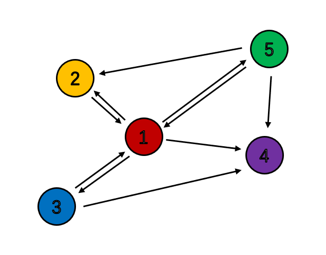

```{r, include = FALSE}
knitr::opts_chunk$set(
  collapse = TRUE,
  comment = "#>"
)
```

```{r setup, echo=FALSE}
library(StatComp20026)
```

# Introduction

**StatComp20026** is a package designed in the course **Statistical Computing** in University of Science and Technology of China, advised by Prof. Hong Zhang and assisted by Ph.D. Anran Liu. 

The current vignette simply contains all the homework of the course **Statistical Computing**.

For several functions useful in model selection, please refer to vignette **model_selection**. 

# HW 0: Before fomally start

## Example 1  
Plug in a figure which is a network, 

```{r pressure, echo=FALSE, fig.cap="A Network", out.width = '30%'}

```

## Example 2  
Plug in a table which contains observed random variables, 

```{r table}
knitr::kable(matrix(rnorm(25, 0, 1), ncol = 5), col.names = paste("Col",1:5,sep = " "),  caption = "A Random Matrix")
```

## Example 3  
Plug in some formula

$$
\begin{aligned}
\mathcal{LL}_{cp} =& 
        \sum_{t_i<\tau}
        \log\left(\sum_{t_j<t_i}\alpha_{u_i,u_j}\beta e^{-\beta(t_i-t_j)}\right)
        -\sum_{j=1}^d\sum_{t_i<\tau}\alpha_{j,u_i}\left(1-e^{-\beta(\tau-t_i)}\right)\\
        +&\sum_{\tau\leq t_i<t}\log\left(\sum_{t_j<\tau} \alpha_{u_i,u_j}\beta e^{-\beta(\tau-t_j)} \right)-(t-\tau)\sum_{j=1}^d\sum_{t_i<\tau}\alpha_{j,u_i}\beta e^{-\beta(\tau-t_i)}
\end{aligned}
$$


# HW 1: Introduction

## 3.3  
The Pareto $(a, b)$ distribution has cdf
$$
F(x)=1-\left(\frac{b}{x}\right)^{a}, \quad x \geq b>0, a>0
$$
Derive the probability inverse transformation $F^{-1}(U)$ and use the inverse transform method to simulate a random sample from the Pareto(2,2) distribution. Graph the density histogram of the sample with the Pareto(2,2) density superimposed for comparison.

### Solution. 

First we derive the probability inverse transformation $F^{-1}(U) .$ Denote $y:=F(x),$ then we have
$$
\begin{aligned}
& y=1-\left(\frac{b}{x}\right)^{a} \\
\Longrightarrow &\left(\frac{b}{x}\right)^{a}=1-y \\
\Longrightarrow & \log (b)-1 / a \log (1-y)=\log (x) \\
\Longrightarrow & x=\frac{b}{(1-y)^{1 / a}}
\end{aligned}.
$$
Since $y=F(x),$ then $x=F^{-1}(y) .$ Indeed, we have $F^{-1}(U)=\frac{b}{(1-U)^{1 / a}}$. 

Now we use the inverse transform method to simulate a random sample from the Pareto (2, 2) distribution.

Firstly we exhibit the algorithm below. 

*[Using Inverse Transform Method to simulate random samples from continuous distribution]*
1. Generate $U \sim U(0,1)$
1. Return $X=F^{-1}(U)$

Based on the derivation above, we can easily apply the algorithm.

```{r}
#Use the inverse transform method to simulate a random sample from the Pareto(2, 2) distribution

#Generate U ~ U(0, 1)
u = runif(1)
#Return x = F^{-1}(u)
x = round(2/sqrt(1-u), 3)
print(paste("The random sample wanted is ", x, ".", sep = ""))
```

Now let’s generate a large amount of data to graph the density histogram and superimpose the theoretical
density function.

```{r}
library(ggplot2)
#generate data with amount == 5000
u = runif(5000)
x = round(2/sqrt(1-u), 3)
x = x[x<=15]

#gather the data into a dataframe
df = data.frame(sample = x)

#histogram
ggplot(df, aes(x = sample)) + geom_histogram(binwidth = 0.5, aes(y=..density..), boundary = 2) + labs(title="Histogram of random samples")
```

Recall that $F(x)=1-\left(\frac{x}{b}\right)^{-a},$ we can easily get $f(x)=\frac{a b^{a}}{x^{a+1}}=\frac{8}{x^{3}} .$ Now we are ready to superimpose the theoretical density function onto the histogram. 

```{r}
#density
funpareto = function(x){8/(x^3)}

#plot
ggplot(df, aes(x = sample)) + geom_histogram(binwidth = 0.5, aes(y=..density..), boundary = 2) + stat_function(fun=funpareto,geom="line") + labs(title="Histogram superimposed of theoretical density function")
```


## 3.9  

The rescaled Epanechnikov kernel [85] is a symmetric density function
$$
f_{e}(x)=\frac{3}{4}\left(1-x^{2}\right), \quad|x| \leq 1
$$

Devroye and Gyorfi $[71,$ p. 236$]$ give the following algorithm for simulation from this distribution. Generate iid $U_{1}, U_{2}, U_{3} \sim$ Uniform $(-1,1) .$ If $\left|U_{3}\right| \geq$ $\left|U_{2}\right|$ and $\left|U_{3}\right| \geq\left|U_{1}\right|,$ deliver $U_{2} ;$ otherwise deliver $U_{3} .$ Write a function to generate random variates from $f_{e},$ and construct the histogram density estimate of a large simulated random sample.

### Solution. 

We firstly summarize the algorithm below in a form of **pseudo code**.  

*[Simulation of The rescaled Epanechnikov kernel]*
```{r, eval=FALSE}
Generate i.i.d U1, U2, U3 ~ Uniform(-1,1)
if(|U3|>=|U2| and |U3| >= |U1|){
  return(U2)
}
else{
  return(U3)
}
```

Now we follow the algorithm to generate samples and plot.

```{r}
library(ggplot2)
#generate samples
n = 10000
u = matrix(runif(3*n, min = -1, max = 1), nrow = 3)
sample = apply(u, MARGIN = 2, FUN = function(x){ifelse(abs(x[3])>abs(x[2]) & abs(x[3])>abs(x[1]), x[2], x[3])})
df = data.frame(sample = sample)

#construct the histogram density estimate
ggplot(df, aes(x = sample)) + geom_histogram(binwidth = 0.05, aes(y=..density..), boundary = -1) + geom_freqpoly(binwidth = 0.05, aes(y=..density..)) + labs(title="Histogram with density estimated")
```


## 3.10  

Prove that the algorithm given in Exercise 3.9 generates variates from the density $f_{e}$

### Solution. 

Recall the algorithm, 

*[Simulation of The rescaled Epanechnikov kernel]*
```{r, eval=FALSE}
Generate i.i.d U1, U2, U3 ~ Uniform(-1,1)
if(|U3|>=|U2| and |U3| >= |U1|){
  return(U2)
}
else{
  return(U3)
}
```

We now abstract the idea in this algorithm to ease our proof. 

In the algorithm, if $|U_3| = \max(\{|U_i|\}_{i\in\{1,2,3\}})$, then we deliver $U_2$. Consider in this step whether the algorithm will change if we deliver $U_1$. Actually the algorithm remains the same if we deliver $U_1$ instead of $U_2$ when $|U_3| = \max(\{|U_i|\}_{i\in\{1,2,3\}})$. The reason is that given $|U_3|$ is the largest absolute value among the three, $U_1$ and $U_2$ are in a symmetric relationship. It is just fine to choose anyone of them. 

And if (corresponding to the "else" in the algorithm) $|U_3|$ is not the largest value, then there must be one of $U_1$ and $U_2$ is in the symmetric relationship with $U_3$. Though we do not know which is the one symmetrical to $U_3$, still it is just fine to deliver $U_3$.

To summarize, the algorithm aims to deliver randomly one of the two random variables which are not the largest in the three. 

With the understanding of the idea of the algorithm, we can easily finish the proof.

Denote the result of the algorithm as $U$ and its density as $f_U$. Also we care about $|U|$ whose density function is denoted as $f_{|U|}$. Also $\{|U|_{(1)}, |U|_{(2)}, |U|_{(3)}\}$ represents the order statistics of $\{|U_i|\}_{i\in\{1,2,3\}}$ descendingly.

$$
\begin{split}
f_{|U|}(u) &= 1/2 f_{|U|:|U| = |U|_{(2)}}(u) + 1/2 f_{|U|:|U| = |U|_{(3)}}(u)\\
&= 3u(1-u)+3/2(1-u)^2\\
&= 3/2(1-u^2), \quad u\in[0,1].
\end{split}
$$
Then we average the probability mass on $[0,1]$ to $[-1,1]$ symmetrically and we get to the final fomula

$$
f_e(u) = f_U(u) = 3/4(1-u^2), \quad u\in[-1,1].
$$


## 3.13 
It can be shown that the mixture in Exercise 3.12 has a Pareto distribution with cdf
$$
F(y)=1-\left(\frac{\beta}{\beta+y}\right)^{r}, \quad y \geq 0
$$
(This is an alternative parameterization of the Pareto cdf given in Exercise
$3.3 .)$ Generate 1000 random observations from the mixture with $r=4$ and $\beta=2 .$ Compare the empirical and theoretical (Pareto) distributions by graphing the density histogram of the sample and superimposing the Pareto density
curve.

### Solution. 

For the clarity in notations, we say

$$
y = F(x) = 1-\left(\frac{\beta}{\beta+x}\right)^{r}
$$
Then we have
$$
f(x) = \frac{r\beta^r}{(\beta+x)^{r+1}}
$$

and 

$$
x = F^{-1}(y) = \beta\left(\frac{1}{(1-y)^{1/r}} - 1\right)
$$

By the Algorithm \ref{inverse transform} in \textbf{Ex 3.3},  we have

```{r}
library(ggplot2)
#generate data
r = 4
beta = 2
u = runif(1000)
x = beta * (1/(1-u)^(1/r) - 1)
x = x[x<=3]

#density function
beta_r_pareto = function(x, beta, r){r*beta^r/(beta+x)^(r+1)}

#gather the data into a dataframe
df = data.frame(sample = x)

#histogram
ggplot(df, aes(x = sample)) + geom_histogram(binwidth = 0.05, aes(y=..density..), boundary = 0) +  stat_function(fun=function(x){beta_r_pareto(x, beta, r)},geom="line") + labs(title="Histogram superimposed of theoretical density function")

```

# HW 2: Random number generation 

## 5.1  

**Compute a Monte Carlo estimate of**
$$
\int_{0}^{\pi / 3} \sin t d t
$$

**and compare your estimate with the exact value of the integral. **

$\quad$

**Solution.**

$$
\int_{0}^{\pi / 3} \sin t d t = \frac{\pi}{3} \mathbb{E}\sin(X),\quad X\sim U(0,\pi/3)
$$

*[Algorithm Flowchart]*

1. Generate a large amount of $X_i\sim U(0,\pi/3),1\leq i \leq n$. 

2. Calculate $\sin(X_i)$.

3. Calculate the average $\overline{\sin(X_i)} = \frac{1}{n}\sum_{i=1}^n \sin(X_i)$. 

4. The integration approximates $\frac{\pi}{3}\overline{\sin(X_i)}$.


```{r}
n = 10^6
x = runif(n, min = 0, max = pi/3)
result = round(pi/3 * mean(sin(x)), 4)
print(paste("The approximated integation is ", result, ".", sep = ""))
```
 
The result is rather close to the theoretical value which can be calculated as 

$$
\int_{0}^{\pi / 3} \sin t d t = \left.(-\cos t)\right|_{0}^{\frac{\pi}{3}} = 0.5.
$$


## 5.7  
**Refer to Exercise $5.6$. Use a Monte Carlo simulation to estimate $\theta$ by the antithetic variate approach and by the simple Monte Carlo method. Compute an empirical estimate of the percent reduction in variance using the antithetic variate. Compare the result with the theoretical value from Exercise $5.6$. **

$\quad$

**Solution. **

For the clarity, it is necessary to recall the content in Exercise $5.6$. 

We have Monte Carlo integration as 

$$
\theta=\int_{0}^{1} e^{x} d x.
$$


$\quad$

*[Simple Monte Carlo Method Flowchart]*

1. Generate a large amount of $U_i\sim U(0, 1),1\leq i \leq n$. 

2. Calculate $\exp(U_i)$.

3. Calculate the average $\overline{\exp(U_i)} = \frac{1}{n}\sum_{i=1}^n \exp(U_i)$. 

4. The integration approximates $\overline{\exp(U_i)}$.


*[Antithetic Variate Monte Carlo Method Flowchart]*

1. Generate a large amount of $U_i\sim U(0, 1),1\leq i \leq n/2$. 

2. Calculate $\exp(U_i)$ and $\exp(1-U_i)$.

3. Calculate the average $\overline{\exp(U_i)} = \frac{2}{n}\sum_{i=1}^{n/2} \exp(U_i)$ and $\overline{\exp(1-U_i)} = \frac{2}{n}\sum_{i=1}^{n/2} \exp(1-U_i)$. 

4. The integration approximates $\frac{\overline{\exp(U_i)}+\overline{\exp(1-U_i)}}{2}$.

Theoretically, the origin variance is 

\begin{equation*}
\begin{split}
Var(\exp(U)) &= \int_0^1 \exp(2u)\mathrm{d}u - \left(\int_0^1\exp(u)\mathrm{d}u\right)^2\\
 &= \frac{4e-e^2-3}{2} \approx 0.242
\end{split}
\end{equation*}

\begin{equation*}
\begin{split}
Var(\overline{\exp(U_i)}) &= \frac{1}{n} Var(\exp(U))
\end{split}
\end{equation*}

The variance of antithetic variate is 

\begin{equation*}
\begin{split}
Var\left(\frac{\exp(U)+\exp(1-U)}{2}\right) &=\frac{1}{4} \int_0^1 \left(\exp(u)+\exp(1-u) \right)^2\mathrm{d}u - \left(\int_0^1\exp(u)\mathrm{d}u\right)^2\\
 &= \frac{1}{4} \left(2\int_0^1 \exp(2u)\mathrm{d}u+ 2\int_0^1 e \mathrm{d}u\right) - \left(\int_0^1\exp(u)\mathrm{d}u\right)^2\\
 &= \frac{1}{4} (e^2-1+2e) - (e-1)^2\\
 & = \frac{10e-3e^2-5}{4} \approx 3.912\times 10^{-3}
\end{split} 
\end{equation*}

\begin{equation*}
\begin{split}
Var(\frac{\overline{\exp(U_i)}+\overline{\exp(1-U_i)}}{2}) &= \frac{2}{n} Var\left(\frac{\exp(U)+\exp(1-U)}{2}\right)
\end{split}
\end{equation*}


So the theoretical variance reduction is calculated below 

$$
\text{Variance Reduction} = \frac{0.242-2\times3.912\times 10^{-3}}{0.242} \times 100\%\approx 96.77\%.
$$

Now we move to the simulation stage. 

```{r}
#Simple Monte Carlo Method 
n = 10^6
u = runif(n)
x1 = exp(u)
m1 = mean(x1)
print(paste("The estimation of the integration under Simple Monte Carlo Method is ", round(m1, 3), ".", sep = ""))

#Antithetic Variate Monte Carlo Method 
u = runif(n/2)
x2 = 0.5*(exp(u)+exp(1-u))
m2 = mean(x2)
print(paste("The estimation of the integration under Antithetic Variate Monte Carlo Method is ", round(m2, 3), ".", sep = ""))
```

```{r}
mc1 = mc2 = c()
n = 10^4
for (i in 1:1000) {
#Simple Monte Carlo Method 
u = runif(n)
x1 = exp(u)
m1 = mean(x1)
mc1 = c(mc1,m1)

#Antithetic Variate Monte Carlo Method 
u = runif(n/2)
x2 = 0.5*(exp(u)+exp(1-u))
m2 = mean(x2)
mc2 = c(mc2,m2)
}

#Empirical Variance Reduction
vr = 100*(var(mc1)-var(mc2))/var(mc1)
print(paste("The empirical variance reduction is ", round(vr,2), "%.", sep = ""))
```


## 5.11  
**If $\hat{\theta}_{1}$ and $\hat{\theta}_{2}$ are unbiased estimators of $\theta,$ and $\hat{\theta}_{1}$ and $\hat{\theta}_{2}$ are antithetic, we derived that $c^{\ast}=1 / 2$ is the optimal constant that minimizes the variance of $\hat{\theta}_{c}=c \hat{\theta}_{2}+(1-c) \hat{\theta}_{2} .$ Derive $c^{\ast}$ for the general case. That is, if $\hat{\theta}_{1}$ and $\hat{\theta}_{2}$
are any two unbiased estimators of $\theta,$ find the value $c^{*}$ that minimizes the variance of the estimator $\hat{\theta}_{c}=c \hat{\theta}_{2}+(1-c) \hat{\theta}_{2}$ in equation below. ($c^{*}$ will be a function of the variances and the covariance of the estimators.)**

$$\operatorname{Var}\left(c \hat{\theta}_{1}+(1-c) \hat{\theta}_{2}\right)=\operatorname{Var}\left(\hat{\theta}_{2}\right)+c^{2} \operatorname{Var}\left(\hat{\theta}_{1}-\hat{\theta}_{2}\right)+2 c \operatorname{Cov}\left(\hat{\theta}_{2}, \hat{\theta}_{1}-\hat{\theta}_{2}\right)$$

$\quad$

**Solution. **

Define $f(c) = \operatorname{Var}\left(c \hat{\theta}_{1}+(1-c) \hat{\theta}_{2}\right)$.

\begin{equation*}
\begin{split}
f^{(1)}(c) &= 2c \operatorname{Var}\left(\hat{\theta}_{1}-\hat{\theta}_{2}\right)+2  \operatorname{Cov}\left(\hat{\theta}_{2}, \hat{\theta}_{1}-\hat{\theta}_{2}\right)\\
f^{(2)}(c) &= 2 \operatorname{Var}\left(\hat{\theta}_{1}-\hat{\theta}_{2}\right) > 0\\
\end{split}
\end{equation*}

So let the first-order derivative equals to $0$. 

\begin{equation*}
\begin{split}
f^{(1)}(c) &= 2c \operatorname{Var}\left(\hat{\theta}_{1}-\hat{\theta}_{2}\right)+2  \operatorname{Cov}\left(\hat{\theta}_{2}, \hat{\theta}_{1}-\hat{\theta}_{2}\right)=0\\
\implies c^\ast &= -\frac{ \operatorname{Cov}\left(\hat{\theta}_{2}, \hat{\theta}_{1}-\hat{\theta}_{2}\right)}{\operatorname{Var}\left(\hat{\theta}_{1}-\hat{\theta}_{2}\right)}
\end{split}
\end{equation*}

# HW 3: Monte Carlo integration  

## 5.13  
**Find two importance functions $f_{1}$ and $f_{2}$ that are supported on $(1, \infty)$ and are 'close' to**
$$
g(x)=\frac{x^{2}}{\sqrt{2 \pi}} e^{-x^{2} / 2}, \quad x>1
$$
**Which of your two importance functions should produce the smaller variance in estimating**
$$
\int_{1}^{\infty} \frac{x^{2}}{\sqrt{2 \pi}} e^{-x^{2} / 2} d x
$$
**by importance sampling? Explain.**


### Solution.  

Plot the g(x) firstly and imagine the functions with similar shape. 

```{r}
library(ggplot2)
g_sc_hw3 = function(x){
  x^2 * dnorm(x)
}

base <- ggplot() + xlim(1,5)
base +
  geom_function(aes(colour = "g(x)"), fun = g_sc_hw3)
```

We can briefly see two characteristic from the plot of g(x). 

1. Most part of g(x) decays quickly. 

2. g(x) appears a peak around $x = 1.5$. 

By our observation, we might choose Exponential Distribution and Normal Distribution with mean $1.5$. Note that both distributions are truncated before $x=1$. 

```{r}
base +
  geom_function(aes(colour = "g(x)"), fun = g_sc_hw3) + 
  geom_function(aes(colour = "density of normal"), fun = function(x){dnorm(x, mean = 1.5)}) + 
  geom_function(aes(colour = "density of exponential"), fun = dexp)
```

So

\begin{equation}
\begin{split}
\text{Integration} &= \int_{1}^{\infty} \frac{x^{2}}{\sqrt{2 \pi}} e^{-x^{2} / 2} d x\\
& = \int_1^\infty \frac{g(x)}{f(x)} f(x) dx\\
&=\mathbb{E}_f \left[\frac{g(X)}{f(X)}\right], X\sim f.
\end{split}
\end{equation}


In the case of choosing exponential distribution, we have 

\begin{equation}
\begin{split}
f_1 (x) &= \exp\{1-x\}\mathbb{I}(x>1)
\end{split}
\end{equation}

```{r}
m = 10^5
x = rexp(m)
x = x[x>1]
y = g_sc_hw3(x)/exp(1-x)
res = mean(y)
print(paste("The integration using truncated exponential function as the important function is approximated as ", round(res,3), ".", sep = ""))
```


In the case of choosing normal distribution, we have 

\begin{equation}
\begin{split}
f_2 (x) &= \frac{\phi(x-1.5)}{1-\Phi(-0.5)}\mathbb{I}(x>1)
\end{split}
\end{equation}

where $\phi$ is the standard normal density, $\Phi$ is the standard normal cumulative distribution. 

```{r}
m = 10^5
x = rnorm(m, mean = 1.5)
x = x[x>1]
y = g_sc_hw3(x)*(1-pnorm(-0.5))/dnorm(x-1.5)
res = mean(y)
print(paste("The integration using truncated normal function as the important function is approximated as ", round(res,3), ".", sep = ""))
```

Recall the plot, we can tell that the normal case is more similar to $g(x)$, which also means that their ratio is closer to a constant. We can guess that under the normal case, the variance is smaller. 

Indeed, we can show the variance with simulated data as well. 

```{r}
est = est.sd = numeric(2)

m = 10^5
x = rexp(m)
x = x[x>1]
y1 = g_sc_hw3(x)/exp(1-x)


x = rnorm(m, mean = 1.5)
x = x[x>1]
y2 = g_sc_hw3(x)*(1-pnorm(-0.5))/dnorm(x-1.5)

n = min(length(y1), length(y2))
y1 = y1[1:n]
y2 = y2[1:n]

est[1] = mean(y1)
est.sd[1] = sd(y1)
est[2] = mean(y2)
est.sd[2] = sd(y2)

res <- rbind(est=round(est,3), sd=round(est.sd,3))
  colnames(res) <- paste0('f',1:2)
  knitr::kable(res,align='c')
  

```

From the table we can see in the $f_2$ case the standard error is smaller. 


## 5.15  
**Obtain the stratified importance sampling estimate in Example 5.13 and compare it with the result of Example 5.10.**

### Solution. 
We do the theoretical adjustments firstly, 


\begin{equation}
\begin{split}
\int_{0}^{1} \frac{e^{-x}}{1+x^{2}} d x & = \sum_{j = 0}^4 \int_{\frac{j}{5}}^{\frac{j+1}{5}} \frac{e^{-x}}{1+x^{2}} d x\\
\end{split}
\end{equation}

For the clarity in notations, we define 
$$
g(x)= \frac{e^{-x}}{1+x^{2}}
$$

$$
f(x) = \frac{e^{-x}}{1-e^{-1}}
$$


So now the above can be written as
\begin{equation}
\begin{split}
\text{Integration} = \sum_{j = 0}^4 \int_{\frac{j}{5}}^{\frac{j+1}{5}} \frac{g(x)}{f(x)}f(x) d x
\end{split}
\end{equation}

Currently the $f(x)$ is not satisfying enought since it is not a probability density function in $[\frac{j}{5}, \frac{j+1}{5}], \forall j\in\{1,\cdots,5\}$. But we can fix this respectively with the intervals. 

Indeed, with an arbitary $j$ fixed, 

\begin{equation}
\begin{split}
 \int_{\frac{j}{5}}^{\frac{j+1}{5}} f(x) d x &= \int_{\frac{j}{5}}^{\frac{j+1}{5}} \frac{e^{-x}}{1-e^{-1}} d x \\
 & = \frac{e^{-j/5}-e^{-(j+1)/5}}{1-e^{-1}}
\end{split}
\end{equation}

Then we have adjusted version of $f(x)$ on each interval as 
\begin{equation}
\begin{split}
f_j(x) &= f(x)\times \frac{1-e^{-1}}{e^{-j/5}-e^{-(j+1)/5}}\\
&= \frac{e^{-x}}{e^{-j/5}-e^{-(j+1)/5}}
\end{split}
\end{equation}

By the way, it is easy to give the corresponding cumulative distribution along with their inverse function on each interval 

\begin{equation}
\begin{split}
F_j(x) 
&= \frac{e^{-j/5}-e^{-x}}{e^{-j/5}-e^{-(j+1)/5}}
\end{split}
\end{equation}

\begin{equation}
\begin{split}
F_j^{-1}(y) 
&= -\log\left(e^{-j/5}-y\left(e^{-j/5}-e^{-(j+1)/5}\right)\right)
\end{split}
\end{equation}

Also we have the adjusted integration as 

\begin{equation}
\begin{split}
\text{Integration} &= \sum_{j = 0}^4 \int_{\frac{j}{5}}^{\frac{j+1}{5}} \frac{g(x)}{f_j(x)}f_j(x) d x\\
&=\sum_{j = 0}^4 \mathbb{E}_{f_j}\left[\frac{g(X)}{f_j(X)}\right]\\
&\approx \sum_{j = 0}^4 \frac{1}{m_j} \sum_{i=1}^{m_j}\frac{g(x_i^j)}{f_j(x_i^j)}
\end{split}
\end{equation}

Now we finish the theoretical adjustments and are ready to move to the simulation stage. 

```{r}
#g(x)/f_j(z)
g_divide_fj = function(x, j){
  (exp(-j/5)-exp(-(j+1)/5))/(1+x^2)
}

#Total amount of samples
m = 10^4
#Amount of samples in each interval
mj = m/5
#Data Matrix
data.mat = matrix(0, nrow = mj, ncol = 5)
for (j in 0:4) {
  u = runif(mj)
  x = -log(exp(-j/5) - u*(exp(-j/5) - exp(-(j+1)/5)))
  data.mat[,(j+1)] = g_divide_fj(x, j)
}

result = sum(colMeans(data.mat))
print(paste("The estimation of the wanted integration using straitified method is ", round(result, 3), ".", sep = ""))
```

Now we consider the standard error of our estimation. Firstly, we define a statistics $T$

$$
T = \sum_{j = 0}^4 \frac{1}{m_j} \sum_{i=1}^{m_j}\frac{g(X_i^j)}{f_j(X_i^j)}, X_i^j\sim f_i
$$
So

```{r}
n = 10^3
result.vec = numeric(n)
for (i in 1:n) {
  data.mat = matrix(0, nrow = mj, ncol = 5)
  for (j in 0:4) {
    u = runif(mj)
    x = -log(exp(-j/5) - u*(exp(-j/5) - exp(-(j+1)/5)))
    data.mat[,(j+1)] = g_divide_fj(x, j)
  }

  result.vec[i] = sum(colMeans(data.mat))
}

res <- rbind(est=round(c(0.5257801, result),3), sd = round(c(0.0970314, sd(result.vec)),4))
  colnames(res) <- c("Best Importance Sampling in Example 5.10", "Stratified Importance Sampleing")
  knitr::kable(res,align='c')
```


## 6.4  
**Suppose that $X_{1}, \ldots, X_{n}$ are a random sample from a from a lognormal distribution with unknown parameters. Construct a $95 \%$ confidence interval for the parameter $\mu .$ Use a Monte Carlo method to obtain an empirical estimate of the confidence level. **

### Solution. 

$$
X_i = e^{\mu+\sigma Z_i}, Z_i\stackrel{i.i.d.}{\sim}N(0,1).
$$
By t-test, we know that 

$$
\frac{\sqrt{n}\left(\overline{\log(X)}-\mu\right)}{\sqrt{\frac{1}{n-1}\sum\left(\log(X_i)-\overline{\log(X)}\right)^2}}\sim t_{n-1}
$$


# HW 4: Monte Carlo methods in inference 
## 6.7  
Estimate the power of the skewness test of normality against symmetric $\operatorname{Beta}(\alpha, \alpha)$ distributions and comment on the results. Are the results different for heavy-tailed symmetric alternatives such as $t(\nu)$?

### Solution. 

#### 1). Against symmetric $Beta(\alpha, \alpha)$ 
Consider the random variable $X\sim F$, also we define the skewness as 

$$
\sqrt{\beta_{1}}=\frac{E\left[\left(X-\mu_{X}\right)\right]^{3}}{\sigma_{X}^{3}} 
$$

In this problem, we have hypothesis testing as 

$$
H_0: X\sim F_{Norm} \longleftrightarrow H_1: X\sim \operatorname{Beta}(\alpha, \alpha) 
$$
The details of this hypothesis testing are shown in Example 6.8, hence we omit the repeated description. 

*[Flowchart: Monte Carlo experiment to estimate power of a test against a fixed alternative]*

1. Select a particular value of the parameter $\theta_{1} \in \Theta$.

2. For each replicate, indexed by $j=1, \ldots, m$ :
(a) Generate the $j^{t h}$ random sample $x_{1}^{(j)}, \ldots, x_{n}^{(j)}$ under the conditions of the alternative $\theta=\theta_{1}$.
(b) Compute the test statistic $T_{j}$ from the $j^{t h}$ sample.
(c) Record the test decision: set $I_{j}=1$ if $H_{0}$ is rejected at significance level $\alpha,$ and otherwise set $I_{j}=0$

3. Compute the proportion of significant tests $\hat{\pi}\left(\theta_{1}\right)=\frac{1}{m} \sum_{j=1}^{m} I_{j}$

Now we move to the simulation stage. 

**Experiment: Against symmetric $Beta(\alpha, \alpha)$, different sample sizes, fixed $\alpha = 1$ in Beta distribution**
```{r}
skew.ness = function(x) {
#computes the sample skewness coeff.
m3 = mean((x - mean(x))^3)
m2 = mean((x - mean(x))^2)
return( m3 / m2^1.5 )
}

#different sample sizes
n = c(10, 20, 30, 50, 100, 500) 
#critical values for each n 
cv = qnorm(0.975, 0, sqrt(6/n)) 


#n is a vector of sample sizes
#we are doing length(n) different simulations
ht.power = numeric(length(n)) 
m = 1000
for (i in 1:length(n)) {
    sktests = numeric(m) #test decisions 
    for (j in 1:m) {
        x = rbeta(n[i],1,1)
        #test decision is 1 (reject) or 0
        sktests[j] = as.integer(abs(skew.ness(x)) >= cv[i] )
    }
    ht.power[i] = mean(sktests) #proportion rejected
}


knitr::kable(data.frame(t(ht.power), row.names = "Power"), col.names = paste("n =", n))
```

**Experiment: Against symmetric $Beta(\alpha, \alpha)$, fixed sample sizes, different $\alpha$ in Beta distribution**
```{r}
#fixed sample size
n = 100
#different parameter alpha
alpha = c(1, 2, 5, 10, 50, 100) 
#critical values for each n 
cv = qnorm(0.975, 0, sqrt(6/n)) 


#n is a vector of sample sizes
#we are doing length(n) different simulations
ht.power = numeric(length(n)) 
m = 1000
for (i in 1:length(alpha)) {
    sktests = numeric(m) #test decisions 
    for (j in 1:m) {
        x = rbeta(n,alpha[i], alpha[i])
        #test decision is 1 (reject) or 0
        sktests[j] = as.integer(abs(skew.ness(x)) >= cv )
    }
    ht.power[i] = mean(sktests) #proportion rejected
}


knitr::kable(data.frame(t(ht.power), row.names = "Power"), col.names = paste("$\\alpha$ =", alpha))
```

We can see that as $\alpha$ grows large, the power tends to be close to 0.05. 

#### 2). Against $t(\nu)$

**Experiment: Against symmetric $t(\nu)$, different sample sizes, fixed $\nu$ in t distribution**
```{r}
#n is a vector of sample sizes
n = c(10, 20, 30, 50, 100, 500)
#critical values for each n 
cv = qnorm(0.975, 0, sqrt(6/n)) 

#we are doing length(n) different simulations
ht.power = numeric(length(n)) 
m = 1000
for (i in 1:length(n)) {
    sktests = numeric(m) #test decisions
    for (j in 1:m) {
        x = rt(n[i],1)
        #test decision is 1 (reject) or 0
        sktests[j] = as.integer(abs(skew.ness(x)) >= cv[i] )
    }
    ht.power[i] = mean(sktests) #proportion rejected
}

knitr::kable(data.frame(t(ht.power), row.names = "Power"), col.names = paste("n =", n))
```


**Experiment: Against symmetric $t(\nu)$, fixed sample sizes, with different $\nu$ in t distribution**
```{r}
#fixed sample size
n = 100
#different parameter nu
nu = c(1, 2, 5, 10, 50, 100) 
#critical values for each n 
cv = qnorm(0.975, 0, sqrt(6/n)) 


#n is a vector of sample sizes
#we are doing length(n) different simulations
ht.power = numeric(length(n)) 
m = 1000
for (i in 1:length(nu)) {
    sktests = numeric(m) #test decisions 
    for (j in 1:m) {
        x = rt(n,nu[i])
        #test decision is 1 (reject) or 0
        sktests[j] = as.integer(abs(skew.ness(x)) >= cv )
    }
    ht.power[i] = mean(sktests) #proportion rejected
}


knitr::kable(data.frame(t(ht.power), row.names = "Power"), col.names = paste("$\\nu$ =", nu))
```

We can see that as $\nu$ grows large, the power tends to be close to 0.05. 


## 6.8  

Refer to Example 6.16. Repeat the simulation, but also compute the $F$ test of equal variance, at significance level $\hat{\alpha} \doteq 0.055 .$ Compare the power of the Count Five test and $F$ test for small, medium, and large sample sizes. (Recall that the $F$ test is not applicable for non-normal distributions.)

### Solution. 

#### 1). Count Five Test and F test with $\alpha\approx 0.055$

```{r}
#count five test for one pair of samples
count5test <- function(x, y) {
X <- x - mean(x)
Y <- y - mean(y)
outx <- sum(X > max(Y)) + sum(X < min(Y))
outy <- sum(Y > max(X)) + sum(Y < min(X))
# return 1 (reject) or 0 (do not reject H0)
return(as.integer(max(c(outx, outy)) > 5))
}

alpha = 0.055
Ftest = function(x, y, alpha){
  #two sides F test
  F.sta = var(x)/var(y)
  df1 = length(x)
  df2 = length(y)
  return(as.integer((F.sta>qf(1-alpha/2, df1, df2))|(F.sta<qf(alpha/2, df1, df2))))
}

#sample sizes
n = c(5, 30, 100)
#repeated times
m = 1000

#calculate the power
sigma1 <- 1
sigma2 <- 1.5

power = matrix(0, nrow = 2, ncol = length(n))

for (i in 1:length(n)) {
  power[,i] = apply(replicate(m, expr={
x <- rnorm(n[i], 0, sigma1)
y <- rnorm(n[i], 0, sigma2)
c(count5test(x, y), Ftest(x, y, alpha))
}), MARGIN = 1, mean)
}


```

#### 2). Comparison

```{r}
knitr::kable(data.frame(power, row.names = c("Count Five Test", "F test with condifence level 0.055")), col.names = paste("n =", n))
```


## 6.C  

Repeat Examples 6.8 and 6.10 for Mardia's multivariate skewness test. Mardia [187] proposed tests of multivariate normality based on multivariate generalizations of skewness and kurtosis. If $X$ and $Y$ are iid, the multivariate population skewness $\beta_{1, d}$ is defined by Mardia as
$$
\beta_{1, d}=E\left[(X-\mu)^{T} \Sigma^{-1}(Y-\mu)\right]^{3}
$$
Under normality, $\beta_{1, d}=0 .$ The multivariate skewness statistic is
$$
b_{1, d}=\frac{1}{n^{2}} \sum_{i, j=1}^{n}\left(\left(X_{i}-\bar{X}\right)^{T} \widehat{\Sigma}^{-1}\left(X_{j}-\bar{X}\right)\right)^{3}
$$
where $\hat{\Sigma}$ is the maximum likelihood estimator of covariance. Large values of $b_{1, d}$ are significant. The asymptotic distribution of $n b_{1, d} / 6$ is chisquared with $d(d+1)(d+2) / 6$ degrees of freedom.

### Solution.

#### 1). Repeat Example 6.8 for Mardia's multivariate skewness test

Since the notations are described by the problem, we move to the simulation stage. 

```{r}
mul.sk = function(X){
  #X is a n*d matrix containing one group of samples
  n = nrow(X)
  d = ncol(X)
  barX = apply(X, 2, mean)
  Sigma.inverse = solve(var(X))
  
  stat = 0
  for (i in 1:n) {
    for (j in 1:n) {
      stat = stat + (t(X[i,]-barX) %*% Sigma.inverse %*% (X[j,]-barX))^3
    }
  }
  
  stat/(n^2)
}

#different sample sizes
n = c(10, 20, 30, 50, 100)

#dimension d
d = 2
#repeated times
m = 1000

#critical values for each n 
cv = 6*qchisq(0.95, df = d*(d+1)*(d+2)/6)/n 


p.rej = numeric(length(n))
for (i in 1:length(n)) {
  p.rej[i] =mean(replicate(m, expr={
  X = matrix(rnorm(d*n[i]), ncol = d)
  as.integer(mul.sk(X)>cv[i])
}))
}


knitr::kable(data.frame(t(p.rej), row.names = "Type one Error"), col.names = paste("n =", n))
```

#### 2). Repeat Example 6.10 for Mardia's multivariate skewness test

```{r}
#different sample sizes
n = 30
#dimension d
d = 2
#repeated times
m = 1000
#confidence level
alpha = 0.1

#critical values for each n 
cv = 6*qchisq(1-alpha, df = d*(d+1)*(d+2)/6)/n 

#epsilon
epsilon = c(seq(0, 0.14, 0.01), seq(0.15, 1, 0.05))

pwr = numeric(length(epsilon))
for (i in 1:length(epsilon)) {
  e = epsilon[i]
  pwr[i] =mean(replicate(m, expr={
  sigma = sample(c(1, 10), replace = TRUE,
size = n, prob = c(1-e, e))

  X = matrix(rnorm(d*n, sd = sigma), ncol = d)
  as.integer(mul.sk(X)>cv)
}))
}

knitr::kable(data.frame(t(pwr), row.names = "Power"), col.names = paste("$\\epsilon$ =", epsilon))

#plot power vs epsilon
plot(epsilon, pwr, type = "b",
xlab = bquote(epsilon), ylim = c(0,1))
abline(h = .1, lty = 3)
se <- sqrt(pwr * (1-pwr) / m) #add standard errors
lines(epsilon, pwr+se, lty = 3)
lines(epsilon, pwr-se, lty = 3)
```


## Discussion. 

**If we obtain the powers for two methods under a particular simulation setting with 10,000 experiments: say, 0.651 for one method and 0.676 for another method. Can we say the powers are different at 0.05 level? **

1. What is the corresponding hypothesis test problem?

2. What test should we use? Z-test, two-sample t-test, paired-t test or McNemar test?

3. What information is needed to test your hypothesis? 

### Solution. 

#### 1). 

For the first method corresponding to a hypothesis testing, define the random variable of interest as 
$$
X = \mathbb{I}(\text{Reject } H_0^{old} \text{ with first method })
$$

it is easy to see

$$
\mu_1\equiv\mathbb{E}_{H_1^{old}} X = \mathbb{P}_{H_1^{old}}(\text{Reject }H_0^{old} \text{ with first method}) = \text{Power}_1
$$

Similarly we can define $Y$ and $\mu_2 = \text{Power}_2$ corresponding to the second method. 

Now we are interested of the mean shifted problem

$$
H_0: \mu_1 = \mu_2 \longleftrightarrow H_1:\mu_1\neq \mu_2
$$

#### 2). 

If we apply $n$ times Monte Carlo experiments respectively under each method, we will get 
$x_1, x_2, \ldots, x_n$ and $y_1, y_2, \ldots, y_n$. 

Naturally we define 

$$
z_i = y_i-x_i \in\{-1,0,1\}
$$
The problem is transformed to test

$$
H_0: \mu_z = 0 \longleftrightarrow H_1:\mu_z\neq 0
$$

**Z-test**: If we assume the $Z_i$ are i.i.d, then Z-test can be applied if $n$ is large. 

**Two sample t-test**: Two sample t-test requires the independence between the groups of data, which is hard to satisfy since $X$ and $Y$ are the power for the same hypothesis testing, though under different method. 

**Paired t-test**: If we assume $Z_i$ are i.i.d. normal, then we can definitely apply paired t-test. If we only assume $Z_i$ i.i.d but $n$ is large, the paired t-test still works. 

**McNemar Test**: Obviously applicable. 

#### 3). 
Commonly we only need the assumption that $z_i$ are i.i.d, and the observations of all $z_i$. 

# HW 5: Boostrap Jackknife Permutation  

## 7.1  

Compute a jackknife estimate of the bias and the standard error of the correlation statistic in Example 7.2.

### Solution. 

Consider $\hat{\theta}$ representing a plug-in statistic, then we have the jackknife estimate of bias as, details are omitted here


$$
\widehat{\text {bias}}_{\text {jack}}=(n-1)\left(\overline{\hat{\theta}}_{(\cdot)}-\hat{\theta}\right)
$$

where $\overline{\hat{\theta}}_{(\cdot)}=\frac{1}{n} \sum_{i=1}^{n} \hat{\theta}_{(i)}$. 

So we apply the above formula, 

```{r}
library(bootstrap)
#the statistic of interest
theta.hat = cor(law$LSAT, law$GPA)
#sample size
n = nrow(law)

#compute the jackknife replicates, leave-one-out estimates
theta.jack = numeric(n)
for (i in 1:n){
 theta.jack[i] = cor(law$LSAT[-i], law$GPA[-i])
}

bias.jack = (n-1) * (mean(theta.jack) - theta.hat)
bias.jack
```


Next, the jackknife estimate of the standard error of $\hat{\theta}$ is 

$$
\widehat{s e}_{j a c k}=\sqrt{\frac{n-1}{n} \sum_{i=1}^{n}\left(\hat{\theta}_{(i)}-\bar{\theta}_{(\cdot)}\right)^{2}}
$$

The simulation is similar, 

```{r}
#compute the jackknife estimate of se
se.jack = sqrt(sd(theta.jack)^2*(n-1)^2/n)
se.jack

#The results. 
knitr::kable(data.frame(bias.jack, se.jack), col.names =c("Jackknife Estimate of Bias", "Jackknife Estimate of SE"))
```


## 7.5  

Refer to Exercise 7.4. Compute $95\%$ bootstrap confidence intervals for the mean time between failures $1 / \lambda$ by the standard normal, basic, percentile, and BCa methods. Compare the intervals and explain why they may differ.

### Solution. 

We denote the likelihood with $\mathcal{L}$ and the log-likelihood with $\mathcal{LL}$.

Firstly we simply derive the MLE for the hazard rate $\lambda$, 

$$
\begin{aligned}
\mathcal{L} &= \prod_{i=1}^n f(X_i)\\
&=\lambda^n\exp\left\{-\lambda\sum_{i=1}^n X_i\right\}\\
\implies\mathcal{LL} &= n\log(\lambda)-\lambda\sum_{i=1}^nX_i\\
\implies \frac{\partial\mathcal{LL}}{\partial\lambda} &= \frac{n}{\lambda}-\sum_{i=1}^nX_i = 0\\
\implies \hat{\lambda} &= \bar{X}^{-1}
\end{aligned}
$$ 
 
 
# HW 6: Markov Chain Montel Carlo methods 

## 8.3  

The Count 5 test for equal variances in Section 6.4 is based on the maximum number of extreme points. Example 6.15 shows that the Count 5 criterion is not applicable for unequal sample sizes. Implement a permutation test for equal variance based on the maximum number of extreme points that applies when sample sizes are not necessarily equal.

### Solution.  

Since the count five test does not work efficiently under the case for unequal sample sizes, instead we apply the permutation test. 

As is known, even the sample size is not large, the permutations can be a large amount. We choose a random sample from all the permutations. 

Below is the flowchart, 

*[Permutation tests on equal variance]*

1. Use a random sample of $T_{1}^{*}, \ldots, T^\ast_{\left(\begin{matrix}N\\n\end{matrix}\right)}$.

1. Compute the observed test statistic $T(X, Y)=\tilde{T}(Z, \nu)$, $\nu=(1, \ldots, N)$. 

1. For each replicate, indexed $b=1, \ldots, B$:

    1. Generate a random permutation $\pi_{b}=\pi(\nu)$ (sample $(1: N)$)

    1. Compute the statistic $T_{b}^{*}=\tilde{T}\left(Z, \pi_{b}\right)$

1. If a large value of $T$ favors $H_{a}$ (upper-tailed test),
$$
\hat{p}=\frac{1+\#\left\{T_{b}^{*} \geq T\right\}}{1+B}=\frac{1+\sum_{i=1}^{B} I\left(T_{b}^{*} \geq T\right)}{1+B}
$$
For lower-tailed test or two-tailed test, $\hat{p}$ is computed in a similar way.

5. Reject $H_{0}$ at significance level $\alpha$ if $\hat{p} \leq \alpha$

$\quad$

**Case1: $n_1 = 20$, $n_2 = 30$**
```{r}
set.seed(5)
#maximum of extreme points 
max.ext.pts = function(x, y) {
X = x - mean(x)
Y = y - mean(y)
outx = sum(X > max(Y)) + sum(X < min(Y))
outy = sum(Y > max(X)) + sum(Y < min(X))
# return 1 (reject) or 0 (do not reject H0)
return(max(c(outx, outy)))
}

#sample sizes
n1 = 20
n2 = 30

#repeated times
m = 10000

#calculate the power
sigma1 = 1
sigma2 = 1

x = rnorm(n1, 0, sigma1)
y = rnorm(n2, 0, sigma2)
z = c(x, y)
t0 = max.ext.pts(x, y)

  hat.p = (sum(replicate((m-1), expr={
    idx = sample(1:(n1+n2), size = n1, replace = FALSE)
    as.integer(max.ext.pts(z[idx], z[-idx])>=t0)
}))+1)/m

print(paste("The estimate of p value is ", round(hat.p, 4), ".", sep = ""))
```


**Case2: $n_1 = 20$, $n_2 = 50$**
```{r}
set.seed(5)
#maximum of extreme points 
max.ext.pts = function(x, y) {
X = x - mean(x)
Y = y - mean(y)
outx = sum(X > max(Y)) + sum(X < min(Y))
outy = sum(Y > max(X)) + sum(Y < min(X))
# return 1 (reject) or 0 (do not reject H0)
return(max(c(outx, outy)))
}

#sample sizes
n1 = 20
n2 = 50

#repeated times
m = 10000

#calculate the power
sigma1 = 1
sigma2 = 1

x = rnorm(n1, 0, sigma1)
y = rnorm(n2, 0, sigma2)
z = c(x, y)
t0 = max.ext.pts(x, y)

  hat.p = (sum(replicate((m-1), expr={
    idx = sample(1:(n1+n2), size = n1, replace = FALSE)
    as.integer(max.ext.pts(z[idx], z[-idx])>=t0)
}))+1)/m

print(paste("The estimate of p value is ", round(hat.p, 4), ".", sep = ""))
```

So we strongly protect the Null hypothesis in both cases through permutation tests. 


## Design experiments for evaluating the performance of the NN, energy, and ball methods in various situations.

- Unequal variances and equal expectations
- Unequal variances and unequal expectations
- Non-normal distributions: $\mathrm{t}$ distribution with 1 df (heavy-tailed distribution), bimodel distribution (mixture of two normal distributions)
- Unbalanced samples (say, 1 case versus 10 controls)
- Note: The parameters should be chosen such that the powers are distinguishable (say, range from 0.3 to 0.8)

### Solution. 

**Case1: Unequal variances and equal expectations**

```{r}
library(RANN) 
library(boot)
library(energy)
library(Ball)

Tn = function(z, ix, sizes,k) {
n1 = sizes[1]; n2 = sizes[2]; n = n1 + n2
if(is.vector(z)) z = data.frame(z,0);
z = z[ix, ];
NN = nn2(data=z, k=k+1) # what's the first column?
block1 = NN$nn.idx[1:n1,-1]
block2 = NN$nn.idx[(n1+1):n,-1]
i1 = sum(block1 < n1 + .5); i2 = sum(block2 > n1 + .5)
(i1 + i2) / (k * n)
}


m = 1e2; k=3; p=2;  
n1 = n2 = 50; R=999; n = n1+n2; N = c(n1,n2)

eqdist.nn = function(z,sizes,k){
boot.obj = boot(data=z,statistic=Tn,R=R,
sim = "permutation", sizes = sizes,k=k)
ts = c(boot.obj$t0,boot.obj$t)
p.value = mean(ts>=ts[1])
list(statistic=ts[1],p.value=p.value)
}

p.values = matrix(0,m,3)

for(i in 1:m){
x = matrix(rnorm(n1*p, 0, 1.5), ncol = p)
y = cbind(rnorm(n2),rnorm(n2))
z = rbind(x,y)


p.values[i,1] = eqdist.nn(z,N,k)$p.value
p.values[i,2] =eqdist.etest(z,sizes=N,R=R)$p.value
p.values[i,3] = bd.test(x=x,y=y,num.permutations=R, seed = i)$p.value
}

alpha = 0.1;
pow = colMeans(p.values<alpha)
knitr::kable(data.frame(t(pow), row.names = "Power"), col.names = c("NN", "Energy", "Ball"))
```

**Case2: Unequal variances and unequal expectations**
```{r}
mu = 0.3
p.values = matrix(0,m,3)

for(i in 1:m){
x = matrix(rnorm(n1*p, 0, 1.5), ncol = p)
y = cbind(rnorm(n2),rnorm(n2,mean=mu))
z = rbind(x,y)

p.values[i,1] = eqdist.nn(z,N,k)$p.value
p.values[i,2] =eqdist.etest(z,sizes=N,R=R)$p.value
p.values[i,3] = bd.test(x=x,y=y,num.permutations=R, seed = i)$p.value
}

alpha = 0.1;
pow = colMeans(p.values<alpha)
knitr::kable(data.frame(t(pow), row.names = "Power"), col.names = c("NN", "Energy", "Ball"))
```


**Case3: Non-normal distributions: $\mathrm{t}$ distribution with 1 df (heavy-tailed distribution), bimodel distribution (mixture of two normal distributions)**
```{r}
for(i in 1:m){
x = matrix(0.5*rnorm(n1*p, -0.1, 3)+0.5*rnorm(n1*p, 0.1, 3), ncol = p)
y = cbind(rt(n2, df = 1), rt(n2, df = 1))
z = rbind(x,y)


p.values[i,1] = eqdist.nn(z,N,k)$p.value
p.values[i,2] =eqdist.etest(z,sizes=N,R=R)$p.value
p.values[i,3] = bd.test(x=x,y=y,num.permutations=R, seed = i)$p.value
}

alpha = 0.1;
pow = colMeans(p.values<alpha)
knitr::kable(data.frame(t(pow), row.names = "Power"), col.names = c("NN", "Energy", "Ball"))
```

**Case4: Unbalanced samples (say, 1 case versus 10 controls)**

```{r}
n1 = 5
n2 = 50
n = n1+n2; N = c(n1,n2)
p.values = matrix(0,m,3)

for(i in 1:m){
x = matrix(rnorm(n1*p, 0, 1.5), ncol = p)
y = cbind(rnorm(n2),rnorm(n2,mean=mu))
z = rbind(x,y)

p.values[i,1] = eqdist.nn(z,N,k)$p.value
p.values[i,2] =eqdist.etest(z,sizes=N,R=R)$p.value
p.values[i,3] = bd.test(x=x,y=y,num.permutations=R, seed = i)$p.value
}

alpha = 0.1;
pow = colMeans(p.values<alpha)
knitr::kable(data.frame(t(pow), row.names = "Power"), col.names = c("NN", "Energy", "Ball"))
```


# HW 7: Numerical methods in R 
## 9.4  

Implement a random walk Metropolis sampler for generating the standard Laplace distribution (see Exercise 3.2). For the increment, simulate from a normal distribution. Compare the chains generated when different variances are used for the proposal distribution. Also, compute the acceptance rates of each chain. 

Use the Gelman-Rubin method to monitor convergence of the chain, and run the chain until it converges approximately to the target distribution according to $\hat{R}<1.2$.

### Solution. 

*[Flowchart for random walk Metropolis sampler for generating the standard distribution]*

1. Set $g(\cdot \mid X)$ to the density of $N(X, \sigma^2)$.
1. $X_{0}$ is generated from some distribution or manually chosen and stored in ${x}[1]$.
1. Repeat for $i=2, \ldots, N$ :
    1. Generate $Y$ from $N\left(X_{t}, \sigma^2\right)=N(x[\mathrm{i}-1], \sigma^2)$
    1. Generate $U$ from $U(0,1)$
    1. With $X_{t}=x[\mathrm{i}-1],$ compute
$$
r\left(X_{t}, Y\right)=\frac{f(Y) }{f\left(X_{t}\right) } = \frac{e^{-|Y|}}{e^{-|X_t|}}
$$
where $f$ is the Standard Laplace density with parameter. 
If $U \leq r\left(X_{t}, Y\right)$ accept $Y$ and set $X_{t+1}=Y ;$ otherwise set $X_{t+1}=$ $X_{t} .$ Store $X_{t+1}$ in ${x}[\mathrm{i}]$. 

1. Increment $t$.

Now we move to the code stage. 

```{r}
dlaplace <- function(x){
  0.5*exp(-abs(x))
}

rw.Metropolis <- function(sigma, x0, N) {
x <- numeric(N)
x[1] <- x0
u <- runif(N)
k <- 0
for (i in 2:N) {
y <- rnorm(1, x[i-1], sigma)
if (u[i] <= (dlaplace(y) / dlaplace(x[i-1])))
x[i] <- y 
else {
x[i] <- x[i-1]
k <- k + 1
}
}

return(list(x=x, k=k))
}

N <- 4000
sigma <- c(.05, .5, 2, 16)
x0 <- 25
rw1 <- rw.Metropolis(sigma[1], x0, N)
rw2 <- rw.Metropolis(sigma[2], x0, N)
rw3 <- rw.Metropolis(sigma[3], x0, N)
rw4 <- rw.Metropolis(sigma[4], x0, N)
#number of candidate points rejected
knitr::kable(data.frame(t(paste(round(1 - c(rw1$k, rw2$k, rw3$k, rw4$k)/N, 4)*100, "%", sep = "")), row.names = "Accpectance Rate"), col.names = paste("sigma:", sigma))
```

```{r}
Gelman.Rubin <- function(psi) {
# psi[i,j] is the statistic psi(X[i,1:j])
# for chain in i-th row of X
psi <- as.matrix(psi)
n <- ncol(psi)
k <- nrow(psi)
psi.means <- rowMeans(psi) #row means
B <- n * var(psi.means) #between variance est.
psi.w <- apply(psi, 1, "var") #within variances
W <- mean(psi.w) #within est.
v.hat <- W*(n-1)/n + (B/n) #upper variance est.
r.hat <- v.hat / W #G-R statistic
return(r.hat)
}


k <- 4
b <- 1000

N <- 4000
sigma <- 2
x0 <- c(-10, -5, 5, 10)
rw1 <- rw.Metropolis(sigma, x0[1], N)
rw2 <- rw.Metropolis(sigma, x0[2], N)
rw3 <- rw.Metropolis(sigma, x0[3], N)
rw4 <- rw.Metropolis(sigma, x0[4], N)

rw <- list(rw1, rw2, rw3, rw4)
X <- rbind(rw1$x, rw2$x, rw3$x, rw4$x)

#compute diagnostic statistics
psi <- t(apply(X, 1, cumsum))
for (i in 1:nrow(psi))
psi[i,] <- psi[i,] / (1:ncol(psi))
print(Gelman.Rubin(psi))
#plot psi for the four chains

#par(mfrow=c(2,2))
for (i in 1:k)
plot(psi[i, (b+1):N], type="l",
xlab=i, ylab=bquote(psi))
#par(mfrow=c(1,1)) #restore default

#plot the sequence of R-hat statistics
rhat <- rep(0, N)
for (j in (b+1):N)
rhat[j] <- Gelman.Rubin(psi[,1:j])
plot(rhat[(b+1):N], type="l", xlab="", ylab="R")
abline(h=1.2, lty=2)
```


## 11.4 

Find the intersection points $A(k)$ in $(0, \sqrt{k})$ of the curves
$$
S_{k-1}(a)=P\left(t(k-1)>\sqrt{\frac{a^{2}(k-1)}{k-a^{2}}}\right)
$$
and
$$
S_{k}(a)=P\left(t(k)>\sqrt{\frac{a^{2} k}{k+1-a^{2}}}\right)
$$

for $k=4: 25,100,500,1000$, where $t(k)$ is a Student $t$ random variable with $k$ degrees of freedom. (These intersection points determine the critical values for a $t$ -test for scale-mixture errors proposed by Székely [260].)

### Solution. 

Firstly, we define a function of $a$ with a fixed $k$, 

$$
g_k(a) = S_k(a) - S_{k-1}(a)
$$

So if we want to find the intersection points $A(k)$, we can define $A(k)$ as 


$$
A(k) = \operatorname{arg}_{a\in(0, \sqrt{k})}\{g_k(a)=0\}
$$

In order to offer convenience to finding the root, we firstly plot $g_k(a)$ w.r.t. different $k$. 

```{r}
gka = function(k, a){
  pt(sqrt(a^2*(k-1)/(k-a^2)), df = k-1) - pt(sqrt(a^2*(k)/(k+1-a^2)), df = k)
}

plot.gka = function(k, plot.dim){
  #plot.dim is a 2-dim vector for plots
  #par(mfrow=plot.dim)
  n = length(k)
  
  for (i in 1:n) {
    a = seq(from = 0, to = sqrt(k[i]), length.out = 50)[-50]
    plot(x = a, y = gka(k[i], a), type="l",
    xlab=i, ylab=bquote(g))
    abline(h=0, lty=2)
  }
  
  #par(mfrow=c(1,1)) #restore default
  
}

plot.gka(c(4, 8, 12, 24), c(2, 2))
plot.gka(c(25, 100, 500, 1000), c(2, 2))
```

From the above, we see that $g_k = 0$ generally possess a unique root on $(0, \sqrt{k})$.

Now we try to get them. 

```{r}
library("kableExtra")
k = c(4:25, 100, 500, 1000)
n = length(k)
res = numeric(n)

for (i in 1:n) {
  res[i] <- uniroot(function(a) {
gka(k[i], a) },
lower = 0.1, upper = min(sqrt(k[i])-0.1, 5))$root
}

dt = t(data.frame("k" = as.character(k), "root" = res))

kbl(dt) %>%  kable_paper() %>%
  scroll_box(width = "900px", height = "100%")
```
# HW 8: R programming techniques 

## Question 1. 

**A-B-O blood type problem** 

- Let the three alleles be $A, B,$ and $O$. \begin{tabular}{l|l|l|l|l|l|l|l}
\hline Genotype & AA & BB & OO & AO & BO & AB & Sum \\
\hline Frequency & $\mathrm{p}^{\wedge} 2$ & $\mathrm{q}^{-2}$ & $\mathrm{r}^{\wedge} 2$ & $2 \mathrm{pr}$ & $2 \mathrm{qr}$ & $2 \mathrm{pq}$ & 1 \\
\hline Count & $\mathrm{nAA}$ & $\mathrm{nBB}$ & $\mathrm{nOO}$ & $\mathrm{nAO}$ & $\mathrm{nBO}$ & $\mathrm{nAB}$ & $\mathrm{n}$ \\
\hline
\end{tabular} 
- Observed data: $n_{A \cdot}=n_{A A}+n_{A O}=444$ ($\mathrm{~A}$-type) 
$n_{B}=n_{B B}+n_{B O}=132(\mathrm{~B}$-type $), n_{O O}=361(\mathrm{O}$-type $)$ $n_{A B}=63(\mathrm{AB}-\mathrm{type})$ 
- Use EM algorithm to solve MLE of $p$ and $q$ (consider missing data $n_{A A}$ and $\left.n_{B B}\right)$ 
- Record the values of $p$ and $q$ that maximize the conditional likelihood in each EM steps, calculate the corresponding log-maximum likelihood values (for observed data), are they increasing? 

### Solution. 

[*EM Algorithm Flowchart*]

1. Initiate $(p, q)$ with $(p_0,q_0)$.

2. **E-step**: $l_{0}\left(p, q; n_A, n_B, n_{OO}, n_{AB}\right)=E_{p_{0}, q_0}\left[\log L\left(p,q;n_{AA}, n_{BB}, n_{OO}, n_{AO}, n_{BO},n_{AB}\right) \mid n_A, n_B, n_{OO}, n_{AB}\right]$

3. **M-step**: maximize $l_{0}$ w.r.t. $p,q$, let the resultant maximizer be $p_{1}, q_1$.

4. In steps 2 and 3, replace $p_0, q_0$ with $p_1, q_1$, and repeat this process until convergence (iteration).


Now give some details of **E-step** and the **M-step**. 

**E-step**: 

$$
\begin{aligned}
&l_{0}\left(p, q; n_A, n_B, n_{OO}, n_{AB}\right) \\=& E_{p_{0}, q_0}\left[2n_{AA}\log p+2n_{BB} \log q + 2n_{OO} \log r+n_{AO}\log 2pr+n_{BO} \log 2qr+ n_{AB}\log 2pq\mid n_A, n_B, n_{OO}, n_{AB}\right]
\end{aligned}
$$

Meanwhile, 

$$
\begin{aligned}
n_{AA}|n_A \sim B\left(n_A, \frac{p^2}{p^2+2pr}\right)\\
n_{AO}|n_A \sim B\left(n_A, \frac{2pr}{p^2+2pr}\right)\\
n_{BB}|n_B \sim B\left(n_B, \frac{q^2}{q^2+2qr}\right)\\
n_{BO}|n_B \sim B\left(n_B, \frac{2qr}{q^2+2qr}\right)\\
\end{aligned}
$$

As a result, 

$$
\begin{aligned}
l_0 = &2n_A\log p\cdot \frac{p_0^2}{p_0^2+2p_0r_0} + n_A\log 2pr \cdot \frac{2p_0r_0}{p_0^2+2p_0r_0}\\
+ &2n_B\log q\cdot \frac{q_0^2}{q_0^2+2q_0r_0} + n_B\log 2qr \cdot \frac{2q_0r_0}{q_0^2+2q_0r_0}\\
+&2n_{OO}\log r+n_{AB}\log 2pq
\end{aligned}
$$


**M-step**

Let 
$$
\begin{aligned}
\frac{\partial l_0}{\partial p} = 0\\
\frac{\partial l_0}{\partial q} = 0\\
\end{aligned}
$$

Then we have formulae

$$
\begin{aligned}
A_1 r = B_1 p\\
A_2 r = B_2 q
\end{aligned}
$$

where

$$
\begin{aligned}
A_1 =& n_A+n_{AB} +n_A\frac{p_0}{p_0+2r_0}\\
B_1 =& 2n_{OO}+2n_A\frac{r_0}{p_0+2r_0}+2n_B\frac{r_0}{q_0+2r_0}\\
A_2 =& n_B+n_{AB} +n_B\frac{q_0}{q_0+2r_0}\\
B_2 =& B_1 = B\\
\end{aligned}
$$

As a result, 

$$
\begin{aligned}
p = \frac{A_1}{A_1+A_2+B}\\
q = \frac{A_2}{A_1+A_2+B}
\end{aligned}
$$

```{r}
#Known Parameters
na = 444
nb = 132
noo = 361
nab = 63

#EM Algorithm

para.old = c(0.4, 0.4)
para.ma = matrix(para.old, nrow = 2)
para = c(0.1, 0.1)
thres = 1e-6

while (sum((para-para.old)^2)>thres) {
  para.old = para
  r0 = 1 - sum(para.old)
  #Update p, q
  A1 = na+nab+na*para.old[1]/(para.old[1]+2*r0)
  A2 = nb+nab+nb*para.old[2]/(para.old[2]+2*r0)
  B = 2*noo+2*na*r0/(para.old[1]+2*r0)+2*nb*r0/(para.old[2]+2*r0)
  para[1] = A1/(A1+A2+B)
  para[2] = A2/(A1+A2+B)
  para.ma = cbind(para.ma, para)
}

knitr::kable(data.frame(t(round(para, 3)), row.names = "Estimate"), col.names = c("p", "q"))
```

Also we calculate the observed data log likelihood corresponding to each update of $p$ and $q$. 

$$
l(p,q|n_A, n_B, n_{OO}, n_{AB}) ={n_A} \log(p^2+2pr)+n_B\log(q^2+2qr)+2n_{OO}\log r+n_{AB}\log 2pq
$$

```{r}
n = ncol(para.ma)
l = numeric(n)
for (i in 1:n) {
  p = para.ma[1, i]
  q = para.ma[2, i]
  r = 1-p-q
  l[i] = na*log(p^2+2*p*r)+nb*log(q^2+2*q*r)+2*noo*log(r)+nab*log(2*p*q)
}

knitr::kable(data.frame(t(round(l, 3)), row.names = "Log Likelihood"), col.names = 1:n)
```


## Exercise 3, Page 204, Advanced R

Use both for loops and lapply() to fit linear models to the "mtcars" using the formulas stored in this list:

```{r}
formulas <- list(
mpg ~ disp,
mpg ~ I(1 / disp),
mpg ~ disp + wt,
mpg ~ I(1 / disp) + wt
)
```

### Solution. 

#### Loops

```{r}
n = length(formulas)
model = list(NULL)
for (i in 1:n) {
  model[[i]] = lm(formulas[[i]], mtcars)
}
model
```


### lapply

```{r}
model = lapply(formulas, function(fm) lm(fm, mtcars))

model
```


## Exercise 3, Page 213, Advanced R

The following code simulates the performance of a t-test for non-normal data. Use sapply() and an anonymous function to extract the p-value from every trial.

```{r}
trials <- replicate(
100,
t.test(rpois(10, 10), rpois(7, 10)),
simplify = FALSE
)
```

Extra challenge: get rid of the anonymous function by using [[ directly. 

### Solution. 

### Anonymous function 

```{r}
library("kableExtra")
pvalues = sapply(trials, function(test) test$p.value)

dt = data.frame(t(pvalues))
row.names(dt) = "p values"
kbl(dt, col.names = 1:100, row.names = TRUE) %>%  kable_paper() %>%
  scroll_box(width = "900px", height = "100%")
```

### [[]]

```{r}
pvalues = sapply(trials, "[[", 3)

dt = data.frame(t(pvalues))
row.names(dt) = "p values"
kbl(dt, col.names = 1:100, row.names = TRUE) %>%  kable_paper() %>%
  scroll_box(width = "900px", height = "100%")
```


## Exercise 6, Page 214, Advanced R

Implement a combination of Map() and vapply() to create an lapply() variant that iterates in parallel over all of its inputs and stores its outputs in a vector (or a matrix). What arguments should the function take? 

### Solution. 

In the below, lapply.para function is what we want. Actually, Map function will help us to neglect the index and turn the computation into parallelisation. Commonly, its arguments should be taken at least the list:x and the function:f. 

```{r}
lapply.para = function(x, f, ...){
  #parallel computing on x by col
  Map(f = function(x){vapply(x, FUN = f, FUN.VALUE = numeric(1))}, x)
}

eg = list(mtcars, cars)

ptm <- proc.time()
lapply(eg, function(x) vapply(x, mean, numeric(1)))
proc.time()-ptm

ptm <- proc.time()
lapply.para(eg, mean)
proc.time()-ptm
```

We can see the results from the two methods are the same, but somehow the parallelisation does not greatly improve the efficiency. 


# HW 9: High performance with Rcpp

## Former Answer for Exercise 9.4 

```{r}
dlaplace = function(x){
  0.5*exp(-abs(x))
}

rw.Metropolis = function(sigma, x0, N) {
x = numeric(N)
x[1] = x0
u = runif(N)
k = 0
for (i in 2:N) {
y = rnorm(1, x[i-1], sigma)
if (u[i] <= (dlaplace(y) / dlaplace(x[i-1])))
x[i] = y 
else {
x[i] = x[i-1]
k = k + 1
}
}

return(list(x=x, k=k))
}

N = 4000
sigma = c(.05, .5, 2, 16)
x0 = 25
rw1 = rw.Metropolis(sigma[1], x0, N)
rw2 = rw.Metropolis(sigma[2], x0, N)
rw3 = rw.Metropolis(sigma[3], x0, N)
rw4 = rw.Metropolis(sigma[4], x0, N)
#number of candidate points rejected
knitr::kable(data.frame(t(paste(round(1 - c(rw1$k, rw2$k, rw3$k, rw4$k)/N, 4)*100, "%", sep = "")), row.names = "Accpectance Rate"), col.names = paste("sigma:", sigma))
```

## RCpp for Exercise 9.4 

```{r, message=FALSE}
library(StatComp20026)
x = runif(1e4); mean2 = function(x)sum(x)/length(x)
N = 4000
sigma = c(.05, .5, 2, 16)
x0 = 25
rw1 = rwM(sigma[1], x0, N)
rw2 = rwM(sigma[2], x0, N)
rw3 = rwM(sigma[3], x0, N)
rw4 = rwM(sigma[4], x0, N)

#plot psi for the four chains
#par(mfrow=c(2,2))

plot(y = rw1[[1]], x = seq_along(rw1[[1]]),  type="l",
xlab= "index", ylab="random walk samples", main = paste0("sigma = ", sigma[1]))
plot(y = rw2[[1]], x = seq_along(rw2[[1]]),  type="l",
xlab= "index", ylab="random walk samples", main = paste0("sigma = ", sigma[2]))
plot(y = rw3[[1]], x = seq_along(rw3[[1]]),  type="l",
xlab= "index", ylab="random walk samples", main = paste0("sigma = ", sigma[3]))
plot(y = rw4[[1]], x = seq_along(rw4[[1]]),  type="l",
xlab= "index", ylab="random walk samples", main = paste0("sigma = ", sigma[4]))

#par(mfrow=c(1,1)) #restore default

#number of candidate points rejected
knitr::kable(data.frame(t(paste(round(1 - c(rw1[[2]], rw2[[2]], rw3[[2]], rw4[[2]])/N, 4)*100, "%", sep = "")), row.names = "Accpectance Rate"), col.names = paste("sigma:", sigma))
```

### QQ plot 

Here we only choose $\sigma = 2$, without loss of generality. 

```{r}
sample.R = rw.Metropolis(sigma[3], x0, N)
sample.C = rwM(sigma[3], x0, N)

qqplot(x = sort(sample.R[[1]]), y = sort(sample.C[[1]]), xlab = "Samples from R", ylab = "Samples from Cpp", main = "QQ plot between R and Cpp")
abline(0,1,col = "red")
```

### Time Comparison

```{r, message=FALSE}
library('microbenchmark')
ts = microbenchmark(sampleR=rw.Metropolis(sigma[3], x0, N), sampleC=rwM(sigma[3], x0, N))
summary(ts)[,c(1,3,5,6)]
```

### Comments 

Utilization of *Rcpp* improve the efficiency greatly. 

